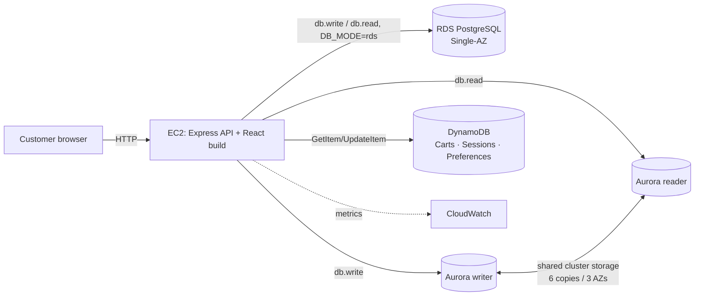
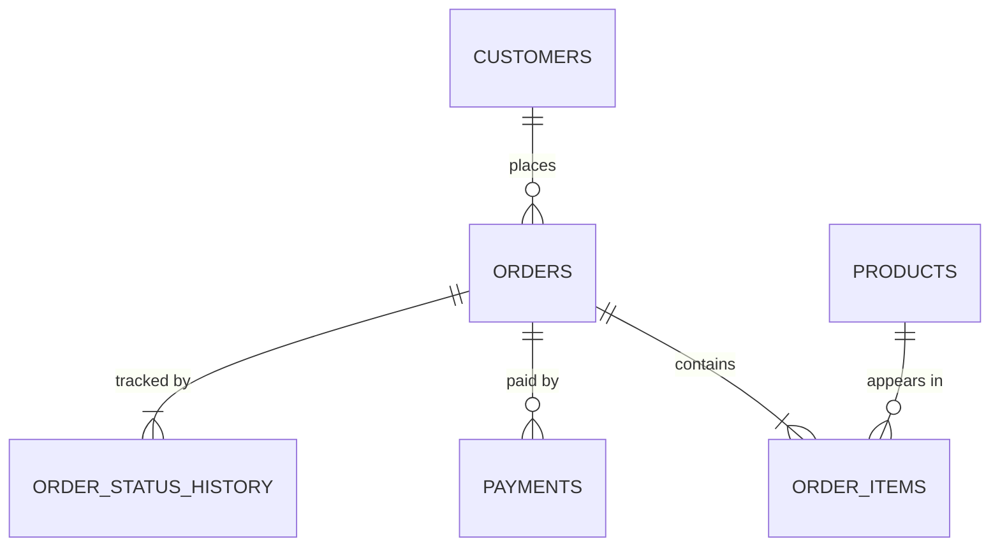

# ARCHITECTURE — ShopSphere

> Source of truth for structure, data models and data routing. If code disagrees with this file, either fix the code or update this file **and** log the decision in `MEMORY.md`.

## 1. Principles

1. **Right database for each access pattern** — relational integrity in RDS/Aurora, key-value hot data in DynamoDB.
2. **Same schema, two relational engines** — one `schema.sql` runs on local Postgres, RDS PostgreSQL and Aurora PostgreSQL; the app switches with `DB_MODE`.
3. **Reads and writes are routed explicitly** — every SQL call goes through `db.read()` or `db.write()`; nothing calls a pool directly.
4. **Everything is observable from the UI** — each response states which store/instance served it.
5. **Cheapest thing that demonstrates the concept** — one small EC2, no load balancer, no NAT gateway, serverless/on-demand wherever possible.

## 2. System overview

```
                         ┌──────────────────────────────────────────────┐
  Browser (React SPA) ──►│ EC2 t4g.micro · Amazon Linux 2023 · pm2       │
     http://<ip>:3000    │ Node 22 + Express 5 (API + static frontend)  │
                         │ IAM instance role (no access keys on disk)   │
                         └──────┬──────────────┬───────────────┬────────┘
               DB_MODE=rds      │              │ DB_MODE=aurora│        AWS SDK (HTTPS)
           ┌────────────────────▼───┐   ┌──────▼───────────────▼───┐   ┌───────────────────────────┐
           │ Amazon RDS PostgreSQL   │   │ Aurora PostgreSQL         │   │ Amazon DynamoDB (on-demand)│
           │ db.t4g.micro, Single-AZ │   │ Serverless (express cfg)  │   │ ShopSphere_Carts          │
           │ private, default VPC    │   │  writer  (AZ-a) ◄─ writes │   │ ShopSphere_Sessions (TTL) │
           │ SG: 5432 from app SG    │   │  reader  (AZ-b) ◄─ reads  │   │ ShopSphere_UserPreferences│
           │ "normal traffic"        │   │ IAM-auth internet gateway │   └───────────────────────────┘
           └─────────────────────────┘   │ "festival sale"           │
                                         └───────────────────────────┘
       CloudWatch: RDS CPU/connections · Aurora ServerlessDatabaseCapacity/ACUUtilization · DynamoDB consumed capacity
       AWS Budgets: zero-spend + monthly cost alerts
```



### Why this shape (decision summary — full log in MEMORY.md)

| Choice | Alternative rejected | Reason |
|---|---|---|
| EC2 + Express monolith | API Gateway + Lambda | Simpler for a 2-person team, persistent DB pools, easy to show in console; Lambda in VPC adds complexity without demo value |
| PostgreSQL | MySQL | Aurora **PostgreSQL** is the Aurora flavour available on the AWS Free plan (express configuration); one SQL dialect everywhere |
| Mock payment gateway | Stripe/Razorpay test mode | Deterministic demo (success/decline on demand), zero external setup; transaction logic is what we're graded on |
| bcrypt + JWT + DynamoDB sessions | Amazon Cognito | Keeps customers in the relational schema the brief asks for; sessions give DynamoDB a second genuine use case |
| Runtime DB mode switch | Two deployments | Lets the video show RDS → Aurora cut-over in seconds |

## 3. Components

| Component | Responsibility | Owner |
|---|---|---|
| `frontend/` React SPA | Pages, cart drawer, badges, admin & insights | B |
| `backend/modules/auth` | Register, login, logout, `me`; bcrypt; JWT cookie; DynamoDB session | B |
| `backend/modules/products` | Catalog queries via `db.read()` | A |
| `backend/modules/cart` | DynamoDB cart with optimistic locking | B |
| `backend/modules/orders` | Checkout transaction, order list/detail/timeline | A |
| `backend/modules/payments` | Mock gateway + payment transaction + idempotency | A |
| `backend/modules/preferences` | Preferences + recently viewed | B |
| `backend/modules/admin` | DB-mode switch, status advance, insights, demo reset | A + B |
| `backend/db/sql/*` | Pools, routing, IAM token, transactions, node info | A |
| `backend/db/dynamo/*` | Document client | B |

## 4. Data placement matrix

| Data | Store | Access pattern | Why here |
|---|---|---|---|
| Customers (profile, password hash) | RDS / Aurora `customers` | by email (login), by id; JOIN with orders | Relational, unique constraint, joins in reports |
| Products & stock | `products` | list/filter/search; row lock at checkout | Stock must change atomically with orders |
| Orders, items, payments, status history | `orders`, `order_items`, `payments`, `order_status_history` | by customer; by order id; joins | Money + integrity ⇒ ACID, FKs |
| Shopping cart | DynamoDB `ShopSphere_Carts` | GetItem/UpdateItem by `customer_id` | Hot, per-user, schema-light, no joins |
| Sessions | DynamoDB `ShopSphere_Sessions` | GetItem by `session_id`; auto-expire | TTL deletes expired sessions for free |
| Preferences / recently viewed | DynamoDB `ShopSphere_UserPreferences` | GetItem/UpdateItem by `customer_id` | Flexible attributes per user |

## 5. Relational schema (PostgreSQL 16+/17) — `database/schema.sql`

```sql
-- Unquoted identifiers fold to lower case in PostgreSQL, so the brief's queries
-- (FROM Customers JOIN Orders …) run unchanged against these tables.

CREATE TABLE customers (
  customer_id    INT GENERATED BY DEFAULT AS IDENTITY (START WITH 101) PRIMARY KEY,
  name           VARCHAR(100) NOT NULL,
  email          VARCHAR(255) NOT NULL UNIQUE,
  phone          VARCHAR(20),
  password_hash  VARCHAR(100) NOT NULL,
  created_at     TIMESTAMPTZ  NOT NULL DEFAULT now()
);

CREATE TABLE products (
  product_id     VARCHAR(10)  PRIMARY KEY,               -- 'P100' — same id the DynamoDB cart stores
  product_name   VARCHAR(150) NOT NULL,
  description    TEXT,
  category       VARCHAR(50)  NOT NULL,
  price          NUMERIC(10,2) NOT NULL CHECK (price >= 0),
  stock          INT           NOT NULL CHECK (stock >= 0),
  image_url      TEXT,
  created_at     TIMESTAMPTZ   NOT NULL DEFAULT now()
);
CREATE INDEX idx_products_category ON products(category);
CREATE INDEX idx_products_name_lower ON products(lower(product_name));

CREATE TABLE orders (
  order_id         BIGINT GENERATED BY DEFAULT AS IDENTITY (START WITH 5001) PRIMARY KEY,
  customer_id      INT NOT NULL REFERENCES customers(customer_id),
  order_date       TIMESTAMPTZ   NOT NULL DEFAULT now(),
  total_amount     NUMERIC(12,2) NOT NULL CHECK (total_amount >= 0),
  status           VARCHAR(20)   NOT NULL DEFAULT 'PLACED'
                   CHECK (status IN ('PLACED','PAYMENT_FAILED','PAID','SHIPPED',
                                     'OUT_FOR_DELIVERY','DELIVERED','CANCELLED')),
  shipping_address TEXT
);
CREATE INDEX idx_orders_customer_date ON orders(customer_id, order_date DESC);

CREATE TABLE order_items (
  order_item_id  BIGINT GENERATED BY DEFAULT AS IDENTITY PRIMARY KEY,
  order_id       BIGINT NOT NULL REFERENCES orders(order_id) ON DELETE CASCADE,
  product_id     VARCHAR(10) NOT NULL REFERENCES products(product_id),
  quantity       INT NOT NULL CHECK (quantity > 0),
  unit_price     NUMERIC(10,2) NOT NULL,                 -- price snapshot at purchase time
  UNIQUE (order_id, product_id)
);

CREATE TABLE payments (
  payment_id       BIGINT GENERATED BY DEFAULT AS IDENTITY PRIMARY KEY,
  order_id         BIGINT NOT NULL REFERENCES orders(order_id),
  amount           NUMERIC(12,2) NOT NULL,
  method           VARCHAR(10) NOT NULL CHECK (method IN ('CARD','UPI','COD')),
  status           VARCHAR(10) NOT NULL CHECK (status IN ('SUCCESS','FAILED')),
  txn_ref          VARCHAR(40) UNIQUE,
  idempotency_key  VARCHAR(64) NOT NULL UNIQUE,
  created_at       TIMESTAMPTZ NOT NULL DEFAULT now()
);
CREATE INDEX idx_payments_order ON payments(order_id);

CREATE TABLE order_status_history (
  history_id   BIGINT GENERATED BY DEFAULT AS IDENTITY PRIMARY KEY,
  order_id     BIGINT NOT NULL REFERENCES orders(order_id) ON DELETE CASCADE,
  status       VARCHAR(20) NOT NULL,
  note         TEXT,
  changed_at   TIMESTAMPTZ NOT NULL DEFAULT now()
);
CREATE INDEX idx_history_order ON order_status_history(order_id, changed_at);
```



**Seed (`seed.sql`)**: customers 101 (Priya), 102, 103; 24 products — `P100–P111` (Electronics, Home) and `P200–P211` (Fashion, Books), so both ids in the brief's cart (`P100`, `P200`) exist — with one low-stock product (`P107`, stock 2) for the rollback demo; 3 historical orders for customer 101 so `WHERE customer_id = 101` returns rows on day one. All seed passwords = `Demo@123` (bcrypt hashed in the file).

**Order status state machine**

```
PLACED ──pay ok──► PAID ──► SHIPPED ──► OUT_FOR_DELIVERY ──► DELIVERED
   │  └─pay fail─► PAYMENT_FAILED ──retry ok──► PAID
   └──────cancel (only PLACED/PAYMENT_FAILED)──► CANCELLED  (stock restored in same txn)
```
Illegal transitions return `409 INVALID_TRANSITION`.

## 6. DynamoDB design — `database/dynamodb/create-tables.sh`

All tables: **on-demand (PAY_PER_REQUEST)**, string keys, default encryption.

| Table | Partition key | Sort key | TTL attr | Notes |
|---|---|---|---|---|
| `ShopSphere_Carts` | `customer_id` (S) | — | — | Exactly one item per customer |
| `ShopSphere_Sessions` | `session_id` (S) | — | `expires_at` (Number, epoch s) | P2: GSI `customer_id-index` for "log out all devices" |
| `ShopSphere_UserPreferences` | `customer_id` (S) | — | — | Free-form attributes |

**Cart item (matches the brief exactly, plus 2 bookkeeping attributes)**
```json
{
  "customer_id": "101",
  "items": [
    { "product_id": "P100", "quantity": 2 },
    { "product_id": "P200", "quantity": 1 }
  ],
  "version": 7,
  "updated_at": "2026-10-05T10:15:00Z"
}
```

**Access patterns**

| Operation | DynamoDB call | Guard |
|---|---|---|
| Get cart | `GetItem(customer_id)` | — |
| Add/update/remove line | read → modify list in code → `PutItem` | `ConditionExpression: attribute_not_exists(customer_id) OR version = :v` → on conflict retry (max 3) |
| Clear after checkout | `DeleteItem(customer_id)` | only after SQL COMMIT |
| Create session | `PutItem` with `expires_at = now + 12h` | `attribute_not_exists(session_id)` |
| Validate session | `GetItem(session_id)` | also check `expires_at > now` (TTL deletion is eventual) |
| Logout | `DeleteItem(session_id)` | — |
| Recently viewed | `UpdateItem SET recently_viewed = list_append(:p, if_not_exists(recently_viewed, :empty))`, trim to 10 in code | — |

Rule: **no `Scan` in any request path.** PartiQL is used only in the console for the demo:
`SELECT * FROM "ShopSphere_Carts" WHERE customer_id = '101'`

## 7. Read/write routing

```js
// backend/src/db/sql/pools.js (shape, not final code)
const pools = {
  rds:    { writer: pgPool(RDS_HOST, password),           reader: same writer pool },
  aurora: { writer: pgPool(AURORA_WRITER_HOST, iamToken), reader: pgPool(AURORA_READER_HOST, iamToken) },
};
let mode = env.DB_MODE;                       // 'rds' | 'aurora', switchable via POST /api/admin/db-mode
export const db = {
  read:  (sql, params) => run(pools[mode].reader, 'reader', sql, params),
  write: (sql, params) => run(pools[mode].writer, 'writer', sql, params),
  tx:    (fn) => withTransaction(pools[mode].writer, fn),
  mode:  () => mode,
};
```

| Operation | Pool | Reason |
|---|---|---|
| Catalog list/search/detail | **reader** | Read-heavy, tolerates ms replica lag — this is the festival traffic |
| Admin reports / insights reader probe | reader | Offload analytics |
| Register, login lookup | writer | Must see a just-registered account |
| Checkout, payment, status change, cancel | writer (`db.tx`) | ACID |
| My orders, order tracking | writer | Read-your-writes right after checkout |

**Which node served it?** `nodeInfo.js` caches per connection:
- Aurora: `SELECT aurora_db_instance_identifier() AS node, pg_is_in_recovery() AS is_reader`
- RDS: `SELECT current_setting('server_version') AS version` + node name from `RDS_INSTANCE_ID` env
Middleware `dataSource.js` sets response headers `X-Data-Source` (`rds|aurora|dynamodb`), `X-DB-Role` (`writer|reader|-`), `X-Served-By` (instance id / table), `X-DB-Latency-Ms`. The UI badge reads these.

## 8. Authentication to the databases

| Target | Method | Detail |
|---|---|---|
| Local Postgres | password | docker-compose defaults |
| RDS PostgreSQL | password (`app_user`, least privilege) | TLS verified with the RDS CA bundle (`global-bundle.pem`); password only in `/home/ec2-user/shopsphere/backend/.env` (chmod 600). Optional hardening: enable IAM DB auth on RDS too |
| Aurora (express config) | **IAM DB authentication only** | `@aws-sdk/rds-signer` → token valid 15 min, used only to open a connection; `pg` pool gets `password: async () => signer.getAuthToken()`; `ssl: { rejectUnauthorized: true }`; DB user `app_user` has `GRANT rds_iam` |
| DynamoDB | IAM instance role | SDK picks up role credentials automatically |

## 9. Key flows

**Checkout (US-08)**
```
POST /api/orders/checkout
 1. GetItem cart(customer_id)                         [DynamoDB]
 2. BEGIN                                              [writer]
 3. SELECT product_id, price, stock FROM products
      WHERE product_id = ANY($1) ORDER BY product_id FOR UPDATE   -- fixed lock order avoids deadlocks
 4. if any stock < qty → ROLLBACK → 409 INSUFFICIENT_STOCK {product_id, available}
 5. INSERT orders(...) RETURNING order_id
 6. INSERT order_items (multi-row, unit_price = current price)
 7. UPDATE products SET stock = stock - qty (per line)
 8. INSERT order_status_history(order_id,'PLACED')
 9. COMMIT
10. DeleteItem cart                                    [DynamoDB]  (if it fails: log, cart is stale but order is safe)
```

**Payment (US-09)**
```
POST /api/orders/:id/pay {method, card_last4?, idempotency_key}
 1. If payments row with idempotency_key exists → return it (no double charge)
 2. mockGateway.charge(): last4 '0002' → FAILED, else SUCCESS, txn_ref = 'MOCK-' + random
 3. BEGIN; INSERT payments; UPDATE orders SET status = PAID|PAYMENT_FAILED
    WHERE order_id = $1 AND status IN ('PLACED','PAYMENT_FAILED'); INSERT history; COMMIT
```

**Login (US-02)**
```
POST /api/auth/login → SELECT customer by email [writer] → bcrypt.compare
 → PutItem session {session_id: uuid, customer_id, expires_at} [DynamoDB]
 → Set-Cookie: token=JWT{sid, cid} (httpOnly, sameSite=lax, 12h)
Every authenticated request → verify JWT → GetItem session → 401 if missing/expired
```

## 10. Network & security

| Item | Setting |
|---|---|
| VPC | **Default VPC** (no new VPC, no NAT gateway) |
| EC2 | Public subnet, public IPv4, SG `shopsphere-app-sg`: inbound TCP 3000 from 0.0.0.0/0 (demo) — **no port 22** (use Session Manager) |
| RDS | `Publicly accessible = No`; SG `shopsphere-rds-sg`: inbound 5432 **only from `shopsphere-app-sg`** |
| Aurora (express) | Not in a VPC; reachable only through Aurora's internet access gateway, which accepts IAM tokens only |
| IAM role `ShopSphereEC2Role` | `AmazonSSMManagedInstanceCore` + inline `ec2-app-policy.json`: DynamoDB actions on `table/ShopSphere_*` only; `rds-db:connect` on the Aurora cluster's `dbuser:<cluster-resource-id>/app_user` (and `/postgres` temporarily for migration) |
| App | helmet, CORS same-origin, rate limit on `/api/auth/*` (10/min/IP), zod validation, parameterised SQL, bcrypt cost 10, JWT secret 32+ random bytes |
| Admin endpoints | require `ADMIN_EMAILS` allow-list (team emails) |

## 11. Environment variables (`backend/.env.example`)

```
PORT=3000
NODE_ENV=production
AWS_REGION=ap-south-1
DB_MODE=rds                         # rds | aurora (also switchable at runtime)
DB_NAME=shopsphere
RDS_HOST=
RDS_INSTANCE_ID=shopsphere-rds
RDS_USER=app_user
RDS_PASSWORD=
RDS_CA_PATH=/home/ec2-user/certs/global-bundle.pem
AURORA_WRITER_HOST=                 # cluster endpoint
AURORA_READER_HOST=                 # cluster-ro endpoint
AURORA_USER=app_user
DDB_ENDPOINT=                       # http://localhost:8000 locally, empty on AWS
DDB_TABLE_CARTS=ShopSphere_Carts
DDB_TABLE_SESSIONS=ShopSphere_Sessions
DDB_TABLE_PREFS=ShopSphere_UserPreferences
JWT_SECRET=
SESSION_TTL_HOURS=12
ADMIN_EMAILS=memberA@college.edu,memberB@college.edu
PG_POOL_MAX=10
PG_IDLE_TIMEOUT_MS=10000            # short, so Aurora can auto-pause when idle
```

## 12. Observability (what we show in CloudWatch)

| Service | Metrics | Why |
|---|---|---|
| Aurora (per instance) | `ServerlessDatabaseCapacity`, `ACUUtilization`, `DatabaseConnections`, `CPUUtilization` | Reader takes browse load and scales during the festival test |
| RDS | `CPUUtilization`, `DatabaseConnections`, `FreeableMemory` | Contrast: fixed instance size |
| DynamoDB | `ConsumedReadCapacityUnits`, `SuccessfulRequestLatency` | Cart traffic, single-digit ms |
| EC2 | `CPUUtilization`, `CPUCreditBalance` | Make sure the app server isn't the bottleneck we blame on the DB |

One free CloudWatch dashboard `ShopSphere-Festival` combines these.

## 13. Failure handling

| Failure | Behaviour |
|---|---|
| Aurora failover (writer changes) | Cluster endpoint DNS moves to new writer; pool drops broken clients (`pool.on('error')`), request retried **once** on connection errors for idempotent reads only; badge shows new writer id |
| Aurora paused (0 ACU) | First query waits for resume (~seconds); pool `connectionTimeoutMillis = 30000` |
| IAM token expired | Not an issue: token fetched per new connection |
| DynamoDB conditional check failed | Retry cart write up to 3×, then 409 `CART_CONFLICT` |
| Cart delete fails after COMMIT | Log warning; next cart read filters products already ordered in last 60 s (P2) |
| Stock race at checkout | Row locks serialise; loser gets 409 `INSUFFICIENT_STOCK` |
